# Hi, I'm Leonardo Ribeiro 👋

### Systems Analyst | API Integrations, Automation & Reliable Software Solutions

I design and implement solutions that connect systems, automate business processes, and turn technical requirements into reliable software.

My background in systems analysis, quality assurance, and technical support gives me a practical approach to development: understand the problem, design the integration, validate edge cases, document the solution, and support it in production.

This profile is a portfolio of completed projects, technical implementations, and academic work that represent my experience and evolution in technology.

  

---

## What I build

- API integrations using REST, Webhooks, and structured data
- Workflow automation for operational and business processes
- Backend-oriented solutions with validation, error handling, and traceability
- Technical documentation, testing strategies, and reproducible environments
- Projects that connect software, data, and real business requirements

## Technical focus

## Featured work

### Scientific research in quantum computing

**Analysis of computational platforms and programming languages for the migration from classical technology to quantum technology**

Academic research developed at Fatec Americana under the guidance of **Dr. Mariana Godoy Vazquez Miano**. The work examined the transition from classical to quantum computing through technical research and practical experiments, including integer-factorization approaches based on Fermat's and Shor's algorithms.

- [Research repository](https://github.com/LeoNardoRR/classical-technology-to-quantum)
- [Final scientific paper — PDF](https://github.com/LeoNardoRR/classical-technology-to-quantum/blob/main/SICT/artigos/SICT_ELS_FINAL.pdf)
- Role: development and technical experimentation

### CLICKARD — awarded technical project

Application created during my Technical Degree in Computer Science to make public transportation information more accessible, including cards, bus schedules, and online top-ups.

- **1st Place — IV MCTEC 2018**
- **1st Place — 2nd Regional Technology Fair (FETEC 2018)**
- **Fisk Highlight Award — IV MCTEC 2019**

## Professional background

I currently work with systems analysis, integrations, and business process automation. My previous experience with ERP support and quality assurance strengthened my ability to troubleshoot complex scenarios, validate requirements, communicate with users, and maintain production stability.

New repositories added here will represent completed, documented projects with a clear problem, implementation, setup instructions, and technical decisions.

## Connect with me

