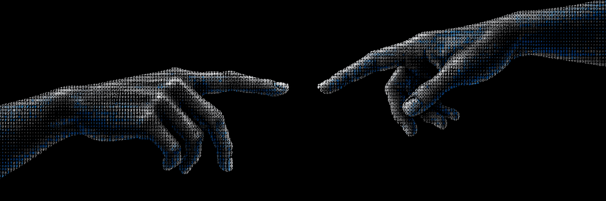
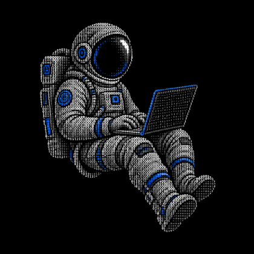

<h1 align="center">Hi, I'm Leonardo Ribeiro 👋</h1>

<strong>Systems Analyst · Integrations · Automation · APIs · Martech</strong>

  

  
  

 

<h2 align="center">🚀 About me</h2>

I design and implement solutions that connect systems, automate business processes, and turn technical requirements into reliable software. My work sits where **systems analysis, APIs, data, automation, and Martech** meet.

My background in **quality assurance and ERP support** shapes how I build: understand the problem, design the integration, validate edge cases, document the solution, and support it in production.

- 🔌 **Integrations:** REST APIs, webhooks, and structured data
- ⚙️ **Automation:** workflows for operational and business processes
- 🧭 **Delivery:** validation, error handling, traceability, and documentation
- 📈 **Martech:** connecting tools and data to make processes more useful

 

 

<h2 align="center">💻 Tech stack & focus</h2>

  
  
  
  
  

I also work with reproducible environments, technical documentation, and solutions that connect software to real business requirements.

 

<h2 align="center">🧩 Featured projects</h2>

### [Clinical scheduling system](https://github.com/LeoNardoRR/agenda-clinica-fullstack)

A full stack scheduling application built with **React, Express, and SQLite**, including holiday validation. It shows how I connect interface, API, and business rules in one workflow.

### [Classical to quantum computing research](https://github.com/LeoNardoRR/classical-technology-to-quantum)

Academic research developed at **Fatec Americana** under **Dr. Mariana Godoy Vazquez Miano**. It explored the transition from classical to quantum computing through research and practical experiments, including integer factorization based on **Fermat's and Shor's algorithms**. I worked on development and technical experimentation with **Jupyter Notebook, Python, Java, Q#, HTML, and CSS**.

↳ [Read the final scientific paper (PDF)](https://github.com/LeoNardoRR/classical-technology-to-quantum/blob/main/SICT/artigos/SICT_ELS_FINAL.pdf)

### CLICKARD · Awarded technical project

An application created during my Technical Degree in Computer Science to make public transportation information more accessible, including cards, bus schedules, and online top-ups.

**Awards:** 1st place at IV MCTEC 2018 and the 2nd Regional Technology Fair (FETEC 2018); Fisk Highlight Award at IV MCTEC 2019.

 

<h2 align="center">📊 GitHub at a glance</h2>

  
  

<h2 align="center">📈 Activity graph</h2>

<h2 align="center">👾 Commit activity</h2>

  

 

<strong>From requirements to production, with clarity at every step.</strong>

<a href="https://www.linkedin.com/in/leonardo-r2022">Let's connect on LinkedIn</a>

